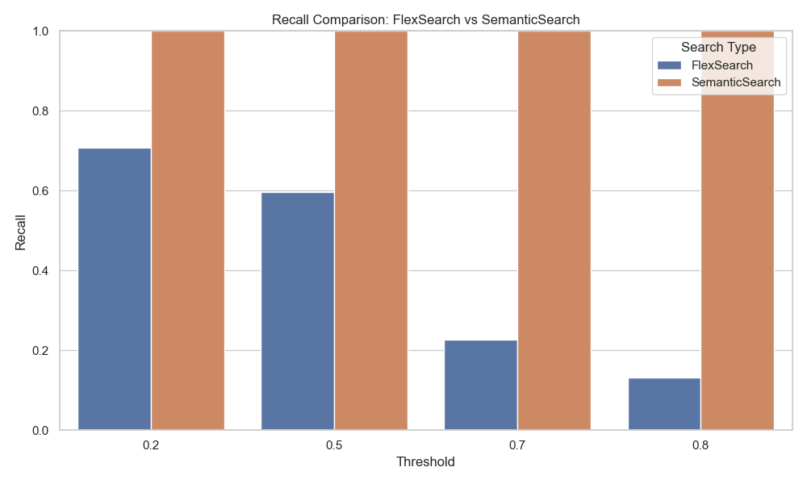

# Search Metrics Evaluation

## Table of Contents
- [Introduction](#introduction)
- [Metrics Explained](#metrics-explained)
  - [Precision](#precision)
  - [Recall](#recall)
  - [F1 Score](#f1-score)
- [Project Overview](#project-overview)
- [Results](#results)
- [Plots](#plots)
- [Usage](#usage)
- [Dependencies](#dependencies)
- [License](#license)
- [Acknowledgements](#acknowledgements)
- [Contact](#contact)

## Introduction

This project evaluates the performance of two search algorithms: **FlexSearch** and **SemanticSearch**. By analyzing key metrics—Precision, Recall, and F1 Score—we aim to understand the effectiveness of each search method in retrieving relevant results across different entities. The project processes search suggestions, interacts with search endpoints, computes performance metrics, and visualizes the results for comprehensive analysis.

## Metrics Explained

### Precision

**Precision** measures the accuracy of the positive predictions made by the model. It is the ratio of correctly predicted relevant instances to the total instances predicted as relevant.

$$
\text{Precision} = \frac{\text{True Positives}}{\text{True Positives} + \text{False Positives}}
$$

Pronounced as: "Precision equals true positives divided by the sum of true positives and false positives"

High precision indicates that the model has a low rate of false positives.


### Recall

**Recall** (also known as Sensitivity) measures the ability of the model to identify all relevant instances. It is the ratio of correctly predicted relevant instances to all actual relevant instances.

$$
\text{Recall} = \frac{\text{True Positives}}{\text{True Positives} + \text{False Negatives}}
$$

Pronounced as: "Recall equals true positives divided by the sum of true positives and false negatives"

High recall indicates that the model has a low rate of false negatives.

### F1 Score

The **F1 Score** is the harmonic mean of Precision and Recall. It provides a single metric that balances both the concerns of precision and recall.

$$
\text{F1 Score} = 2 \times \frac{\text{Precision} \times \text{Recall}}{\text{Precision} + \text{Recall}}
$$

Pronounced as: "F1 Score equals two times precision times recall divided by the sum of precision and recall"

An F1 Score reaches its best value at 1 (perfect precision and recall) and worst at 0.

## Project Overview

The project consists of several key components:

1. **Data Loading and Preparation**: 
   - Metrics are loaded from CSV files generated by FlexSearch and SemanticSearch.
   - A combined dataset is prepared by adding a 'Search Type' column to distinguish between the two search methods.

2. **Metric Calculation**:
   - For each search suggestion, search results are fetched from the respective endpoints.
   - Precision, Recall, and F1 Scores are calculated for each entity (`Tool`, `Goal`, `Post`) across different threshold values.

3. **Visualization**:
   - The computed metrics are visualized using Seaborn's `relplot`.
   - Plots are faceted by entity and saved as PNG files for further analysis.

4. **Automation**:
   - The entire process is automated in the `main.py` script, which orchestrates data loading, metric calculation, and plotting.

## Results

The evaluation results are summarized in CSV files:
- `metrics_flex_search.csv`
- `metrics_semantic_search.csv`

Each CSV file contains the Precision, Recall, and F1 Score for each entity at different threshold levels. These metrics provide insights into how each search algorithm performs in retrieving relevant information.

**Key Observations**:
- **FlexSearch** tends to have higher precision at lower thresholds, indicating more accurate results with fewer false positives.
- **SemanticSearch** excels in recall at higher thresholds, suggesting it retrieves a broader set of relevant results with fewer false negatives.
- The **F1 Score** balances these observations, highlighting the overall effectiveness of each search method across different scenarios.

## Plots

The project generates the following plots to visualize the performance metrics:

1. **Precision Comparison**:
   - Shows how Precision varies with different thresholds for both FlexSearch and SemanticSearch across entities.
   
2. **Recall Comparison**:
   - Illustrates the Recall trends for each search type at varying thresholds.
   
3. **F1 Score Comparison**:
   - Depicts the harmonic mean of Precision and Recall, providing a balanced view of each search method's performance.

4. **Accuracy Variation**:
   - Shows how accuracy varies at different thresholds for both search types across entities.

These plots are saved in the `results` directory as:
- `precision_comparison_plot.png`
- `recall_comparison_plot.png`
- `f1_score_comparison_plot.png`
- `accuracy_variation_plot.png`

### Sample Plots


*Figure 1: Precision Comparison between FlexSearch and SemanticSearch across different entities.*


**Note on Figure 1**:
The threshold of 0.2 might not be reliable because of this imbalance, leading to false positives for some entities but good results for others. Therefore, FlexSearch at 0.2 needs deeper investigation to see why certain entities are overrepresented.



*Figure 2: Recall Comparison between FlexSearch and SemanticSearch across different entities.*


*Figure 3: F1 Score Comparison between FlexSearch and SemanticSearch across different entities.*


*Figure 4: Accuracy Variation at Different Thresholds for FlexSearch and SemanticSearch across different entities.*

**Note on Figure 4**:
The high score for “Goal” at the 0.2 threshold may be misleading because there are few results. With fewer items returned, even a small number of correct matches can inflate metrics like precision and recall, making FlexSearch seem more accurate than it really is. This suggests that the high accuracy might not reflect true performance, but rather the effect of low data points.

## Usage

1. **Setup**:
   - Ensure Python 3.7 or higher is installed.
   - Install the required dependencies using:
     ```bash
     pip install -r requirements.txt     ```

2. **Run the Evaluation**:
   - Execute the main script to perform the evaluation and generate metrics:
     ```bash
     python main.py     ```

3. **View Results**:
   - Check the `results` directory for the CSV files containing metrics and the PNG files with the generated plots.

## Dependencies

- **Pandas**: Data manipulation and analysis.
- **Matplotlib**: Plotting library for creating static, animated, and interactive visualizations.
- **Seaborn**: Statistical data visualization based on Matplotlib.
- **Requests**: HTTP library for sending API requests.
- **Scikit-learn**: Machine learning library used for calculating precision, recall, and F1 scores.

